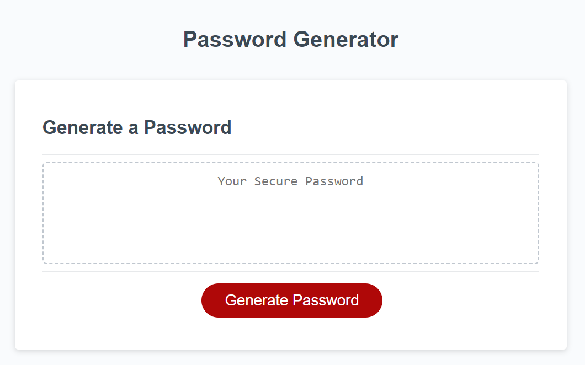
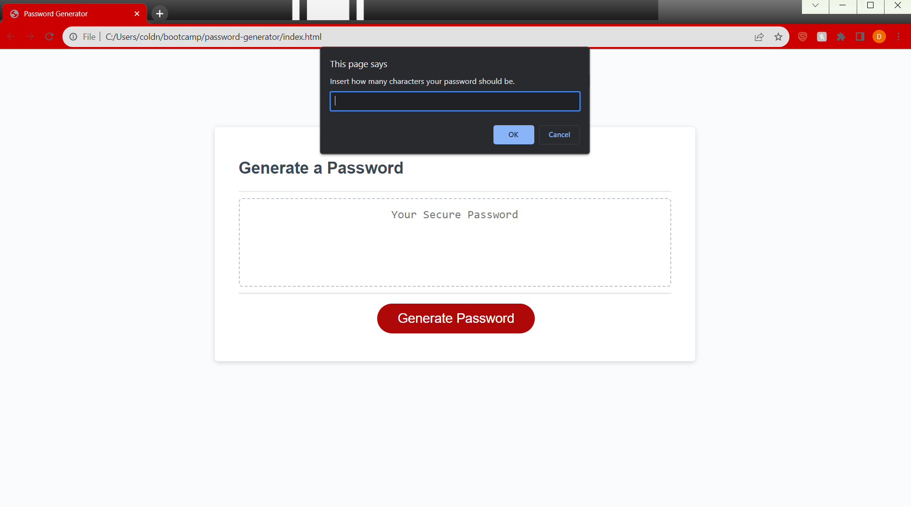

# password-generator

## Description
This project was to help me learn the basics of Javascript and apply them to an existing webpage layout. I learned how to combine different loops to create a certain functionality. I also learned that using different variable types makes value storage easily accessible. Learning how to use the console dev tool to keep track of what the value of certain variables are at specific times helps when trying to diagnose issues within my code.

## Usage
This webpage is designed to create a random password based on conditions provided by the user. To create a password, click the "Generate Password" button. Then, follow the window alert prompts by filling out the desired character length and character inclusion alerts ("OK" for yes and "Cancel" for no).

## Screenshots

## Application
The link to the live application of the webpage is: https://coldnebraska.github.io/password-generator/

## Source Code
The source code is located at the website https://github.com/coldnebraska/password-generator 